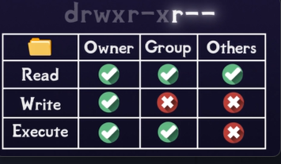

# Users & Sudo

- Multi-User System: Linux supports multiple isolated users. Each user has a private **Home Directory** (`~`) and individual file permissions.

- `sudo` (SuperUser Do): A keyword placed before a command to run it with the unrestricted privileges of the **root** account.

- Risk: `sudo` bypasses all safety rails. Running unknown commands with `sudo` can permanently damage your operating system.

# Whoami and Sudo

- `whoami`: A command that prints the exact username of the account we are currently logged into.

- Normal Execution: Running `whoami` will output our regular username (e.g., `harshita`).

- Elevated Execution: Running `sudo whoami` switches our execution context to the system administrator. It outputs **`root`** because `sudo` forces the command to run with master superuser rights.

```bash
whoami       # Output: harshita
sudo whoami  # Output: root
```

# Permissions

In a Unix-like operating system, permissions control who can do what to which files and directories. The permissions of an individual file or directory are visually represented as a 10-character string:

```bash
drwxrwxrwx
```

-: Regular file (e.g. -rwxrwxrwx)
d: Directory (e.g. drwxrwxrwx)

### -rwxrwxrwx: A file where everyone can do everything
### -rwxr-xr-x: A file where everyone can read and execute, but only the owner can write
### drwxr-xr-x: A directory where everyone can read (ls the contents) and execute (cd into it), but only the owner can write (modify the contents)
### drwx------: A directory where only the owner can read, write and execute



# Changing Permissions

- We can check permission using
```bash
ls -l
```

- We can change the permissions to lock it down by running the chmod command with the uppercase -R flag (which means recursively lock down the private folder and every single file inside it):
```bash
chmod -R u=rwx,g=,o= DIRECTORY
```

# Making a Script Executable

- In Linux, just because a file contains code or commands doesn't mean the computer is allowed to run it. By default, new text files are created with only read and write permissions. To make a file turn into a runnable program, we must explicitly stamp it with an Execute permission bit (x).

- chmod -x filename: This subtracts (-) the execute permission. The file goes back to being a plain text document that you can read, but cannot run.

- chmod +x filename: This adds (+) the execute permission. It flags the operating system saying, "This file is a program, feel free to run it."

- ./filename: The dot-slash tells your terminal to look inside your current directory (.) and execute the program file named right after it.
```bash
chmod -x genids.sh
./genids.sh -> Permission denied
chmod +x genids.sh
we will get the data
```

# The Root User & SudoRoot User:
- The absolute master administrator account with unrestricted system access.

- sudo (SuperUser Do): Grants temporary admin power for one single command, then safely drops you back.

- The Threat (sudo rm -rf /): Forcefully deletes the entire operating system from the root folder (/) upward.

- Golden Rule: Only use sudo for trusted actions (like software installs); never copy-paste unknown sudo commands.

# Chown
- So when do we need to use sudo? chmod allows us to change the permissions of any file or directory that we own. But what if we don't own the file or directory? That's where sudo is required.

- The chown command, which stands for "change owner," allows us to change the owner of a file or directory, and it requires root privileges.

```bash
sudo chown -R root contacts
```
- sudo – Run as the root user
- chown – Command to change the owner
- -R – "Recursive," meaning also apply the changes to everything inside the directory
- root – The name of the new owner
- contacts – The directory to change the owner of

# Using sudo to Delete Restricted Files

- Ownership Restrictions: If a file or folder is owned by `root`, a normal user account cannot modify, rename, or delete it.
- The Security Block: Attempting to delete a root-owned folder normally will fail immediately:
```bash
rm -r contacts
# Output: rm: cannot remove 'contacts': Permission denied
```

- The Admin Bypass: Prepending `sudo` forces the operating system to execute the deletion using the master root account privileges, bypassing the restriction:
```bash
sudo rm -r contacts
```
